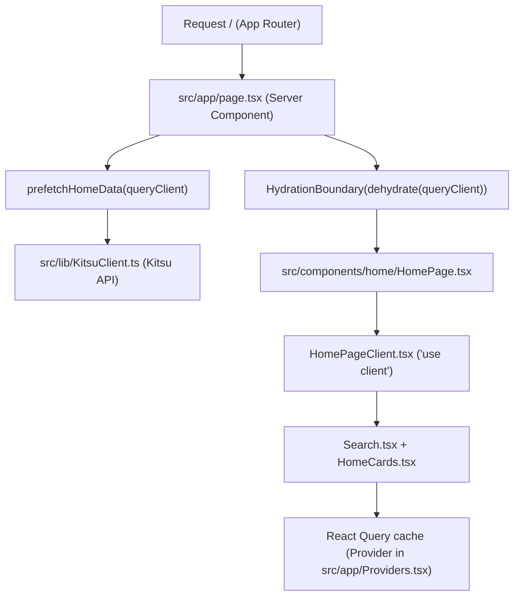

# AniFinder

Personal anime discovery app inspired by AniList, built with Next.js App Router.

Project created by **Marcus Plech**.

## Stack

- Next.js 15 (App Router)
- React 19 + TypeScript
- Tailwind CSS 4
- TanStack React Query 5
- React Hook Form + Yup
- Playwright (E2E) + Vitest (unit)

## Project Setup

```bash
npm install
npm run dev
```

App runs at `http://localhost:3000`.

## Architecture Overview



## Environment Variables

Create `.env.local` (or use `.env.example`) with:

```bash
NEXT_PUBLIC_SITE_URL=http://localhost:3000
```

For production (Vercel), use your real domain.

## Project Configs

### Next.js

- `src/app` uses App Router, with route-level `loading.tsx`, `error.tsx`, and `not-found.tsx`.
- Global metadata and fonts are configured in `src/app/layout.tsx`.
- Remote image hosts are allowed in `next.config.mjs`:
  - `media.kitsu.io`
  - `media.kitsu.app`
  - `kitsu.io`

### Tailwind CSS

- Tailwind v4 is enabled via `@tailwindcss/postcss`.
- Global imports are in `src/app/globals.css`.
- Tailwind content paths are configured in `tailwind.config.ts`.

### React Hook Form

- Form logic lives in `src/components/Signup/Form.tsx`.
- Uses `react-hook-form` + `yup` resolver pattern for validation.

### React Query (TanStack)

- Provider configured in `src/app/Providers.tsx`.
- Query keys centralized in `src/lib/QueryKeys.ts`.
- API client and typed contracts in:
  - `src/lib/KitsuClient.ts`
  - `src/lib/KitsuTypes.ts`
- Home route uses hydration/prefetch with:
  - `src/lib/UseHomePrefetch.ts`
  - `HydrationBoundary` in `src/app/page.tsx`

### E2E (Playwright)

- Config: `playwright.config.ts`
- Tests: `tests/e2e`
- Current smoke test:
  - open home
  - validate main heading and search input
  - click first anime card
  - validate navigation to `/anime/[slug]`

Run commands:

```bash
npm run e2e:install
npm run e2e
```

## Quality Scripts

```bash
npm run lint
npm run lint:fix
npm run format
npm run format:check
npm test
npm run build
```
